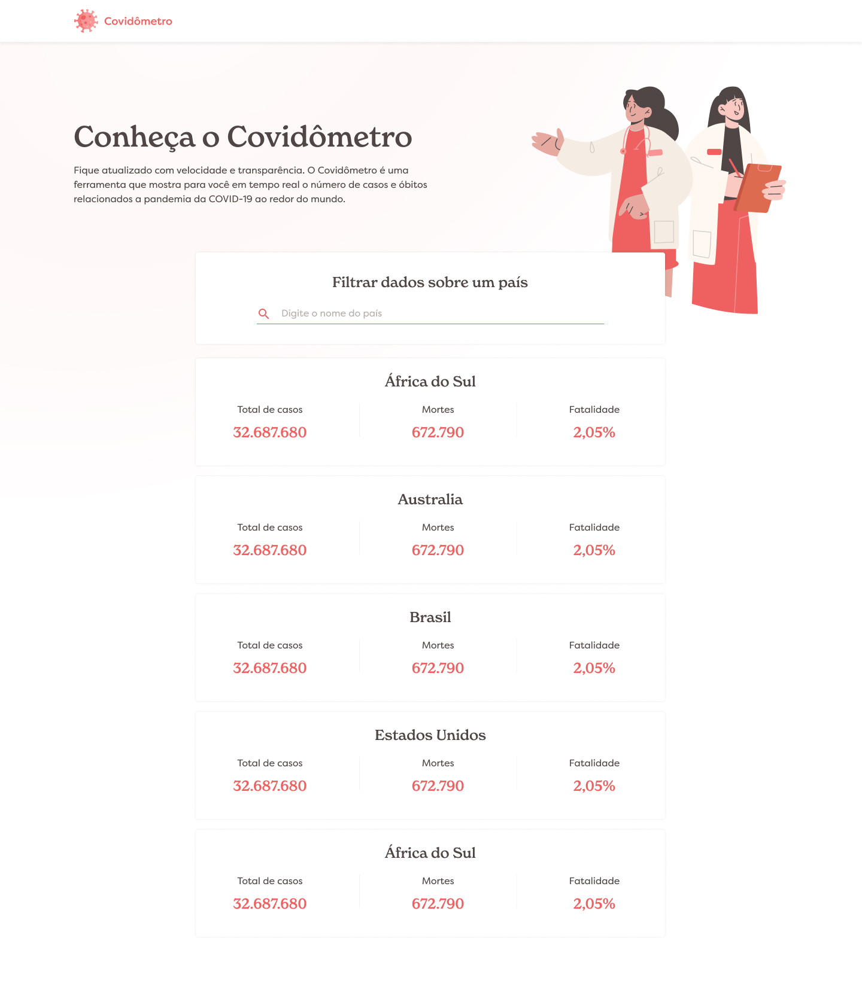

# Farm Investimentos

## Desafio

O desafio consistiu na criação de uma landing page, o Covidômetro, que faz consumo de uma API REST para obter informações sobre a covid-19.

## Layout

O layout da página foi inspirado na seguinte imagem:



## Stack Tecnológica

O projeto foi desenvolvido utilizando as seguintes tecnologias:

- **Axios** como http client
- **Pinia** como gerenciador de estado
- **SASS** com a sintaxe SCSS para estilização
- **Storybook** para documentação visual dos componentes
- **Vite** como bundler
- **Vitest** e **vue/test-utils** para testes unitários
- **Vue 3** com Composition API utilizando JavaScript

## Estrutura do Projeto

A estrutura do projeto segue uma organização simples e objetiva para facilitar o desenvolvimento e a manutenção:

```
farminvest-test/
├── src/
│   ├── assets/         # Recursos adicionais como imagens e variáveis de estilo
│   ├── components/     # Componentes reutilizáveis como botões e inputs
│   ├── layout/         # Componentes mais complexos que dependem de outros componentes
│   ├── router/         # Configuração e definição das rotas da aplicação
│   ├── services/       # Camada de serviço para integração com a API
│   ├── stores/         # Stores do Pinia para gerenciamento de estado
│   ├── utils/          # Funções utilitárias reutilizáveis
│   ├── views/          # Páginas principais da aplicação
│   └── App.vue         # Componente raiz que renderiza o cabeçalho e o router
├── package.json
└── vite.config.js
```

A estrutura dos componentes é a seguinte

```
components/
├── componentName/
│   ├── index.vue
│   ├── componentName.stories.js
│   └── componentName.spec.js
```

Foi desenvolvido dessa maneira para que eu pudesse agrupar tudo que fosse referente àquele componente, facilitando a organização

## Setup

Para configurar o projeto localmente, siga os passos abaixo:

1. Clone o repositório:
   ```sh
   git clone 'https://github.com/Daan-Cardoso/farminvest-teste'
   ```
2. Acesse o diretório do repositório:
   ```sh
   cd farminvest
   ```
3. Instale as dependências utilizando npm ou yarn:

   ```sh
   npm install
   ```

   ou

   ```sh
   yarn install
   ```

   **Nota:** Para fins de desenvolvimento, foi utilizado `yarn`.

4. Execute o projeto:
   ```sh
   npm run dev
   ```
   ou
   ```sh
   yarn dev
   ```
   O projeto será iniciado na porta padrão do Vite (geralmente `http://localhost:5137`).

## Storybook

Foram criados stories para os components e para arquivos de layout, para executar basta rodar o npm script `storybook`

1. Execute o script:

   ```sh
   yarn storybook
   ```

   ou

   ```sh
   npm run storybook
   ```

## Testes unitários

Foram criados testes unitários apenas para os components primitivo, para executar basta rodar o npm script `test`

1. Execute o script:

   ```sh
   yarn test
   ```

   ou

   ```sh
   npm run test
   ```
